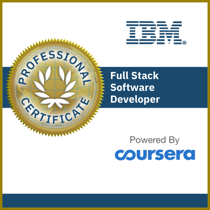
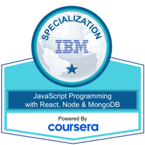
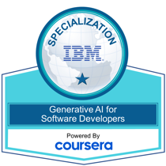
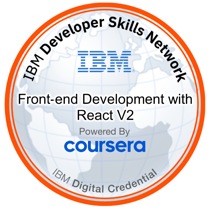
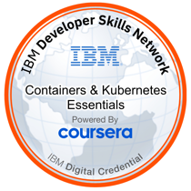
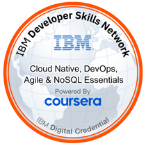

<picture>
  <source media="(prefers-color-scheme: dark)" srcset="https://readme-typing-svg.demolab.com?font=Fira+Code&weight=500&size=20&duration=3500&pause=1200&color=3BC9DB&center=true&vCenter=true&width=620&lines=Mobile+SDK+%C2%B7+React+Native+%E2%86%92+Swift+%26+Kotlin;Encrypted+transport+%C2%B7+server-driven+UI;Load+%26+performance+engineering;Making+slow+systems+fast">
  
</picture>

Building enterprise conversational AI for banking at [DataKite](https://www.linkedin.com/showcase/datakite-services) · Amman, Jordan

---

## About

I'm a Computer Engineering graduate from the University of Jordan, currently a Full Stack Developer
at **DataKite**, where I work on **Rawi** — an enterprise conversational-AI platform for banking.
Most of my time goes to the customer-facing mobile SDK: encrypted transport, server-driven UI, and
Arabic/English voice interaction, now being rewritten from React Native into native Swift and Kotlin.

What I bring beyond the application layer is a systems background. I administered Linux and
distributed compute for EDA workloads at **Synopsys**, then spent time load- and stress-testing
enterprise systems at **Q-Pros** to find where they break before customers do. That combination
means I don't just ship features — I know how they behave under load, in containers, and in
production.

**Stack:** React Native · Swift · Kotlin · React · Next.js · Node.js/NestJS · Java/Spring Boot · PostgreSQL · Docker

---

## GitHub Activity

<!-- Regenerated daily by .github/workflows/3d-contribution-graph.yml and published to the output branch. -->

<picture>
  <source media="(prefers-color-scheme: dark)" srcset="https://raw.githubusercontent.com/OmarSweiti/OmarSweiti/output/3d-contrib-dark.svg">
  <source media="(prefers-color-scheme: light)" srcset="https://raw.githubusercontent.com/OmarSweiti/OmarSweiti/output/3d-contrib-light.svg">
  
</picture>

Regenerated daily from my GitHub contribution history.

---

## Experience

### Full Stack Developer — DataKite
**Amman, Jordan** &nbsp;·&nbsp; *Jun 2026 – Present*

Full-stack engineer on **Rawi**, an enterprise conversational-AI platform built for banking clients.

- Ship the **customer-facing mobile SDK** — React Native compiled to native iOS and Android binaries — with **encrypted transport**, **server-driven UI**, and **Arabic/English voice interaction**.
- **Leading the SDK's rewrite into native Swift and Kotlin**, moving the client off React Native for performance and platform fidelity.
- Contribute to the **React web console** and the **Java / Spring Boot** backend services behind the platform.
- Run **load testing across platform services**, carrying performance-engineering practice into product work.

 

### Load and Performance Engineer — Quality Professionals (Q-Pros)
**Amman, Jordan** &nbsp;·&nbsp; *Mar 2026 – Jun 2026*

Owned load and performance validation for enterprise systems — establishing whether they hold up
under peak traffic before customers find out they don't.

- Designed and executed comprehensive **load and stress test suites** verifying scalability and stability at peak concurrency.
- Developed **automated scripts** simulating high-concurrency user scenarios against production-like environments.
- Monitored runtime behavior with **APM tooling**, correlating throughput, latency, and resource saturation.
- Identified critical bottlenecks and drove the resulting optimizations, measurably improving application response times.

 

### Application Engineer — Synopsys *(via Omnix Technology)*
**Amman, Jordan** &nbsp;·&nbsp; *Feb 2025 – Aug 2025*

Supported advanced **EDA flows** across large-scale distributed compute environments — workloads
where a misconfigured node or an unautomated step costs hours of engineering time.

- Administered **Linux systems** and managed distributed computing resources supporting design execution at scale.
- Developed **shell scripts** to automate repetitive engineering workflows and reduce manual intervention.
- Partnered with engineering teams to optimize flows, troubleshoot failures, and keep high-performance runs reliable.
- Worked to enterprise standards for reliability and reproducibility.

---

## Education

### B.Sc. Computer Engineering — University of Jordan
**Amman, Jordan** &nbsp;·&nbsp; *Oct 2021 – Dec 2025*

A hardware-and-software foundation rather than a purely software one — which is why systems,
performance, and infrastructure work feels natural.

**Core coursework:** Computer Architecture · Operating Systems · Data Structures & Algorithms ·
Databases · Computer Networks · Embedded Systems · Software Engineering

---

## Certifications

I keep two independent credential records. **Coursera** holds the course and specialization
certificates; **Credly** holds the verified digital badges. Each entry links to its own
verification page.

---

### Coursera

**8 specialization & professional certificates** &nbsp;·&nbsp; **47 course certificates**

#### Specializations & Professional Certificates

| Credential | Issuer | Completed | Verify |
|---|---|---|---|
| IBM Full Stack Software Developer Professional Certificate | IBM | Oct 2025 | [Verify](https://www.coursera.org/account/accomplishments/professional-cert/8NS4V4OOWBE9) |
| IBM Full-Stack JavaScript Developer Professional Certificate | IBM | Oct 2025 | [Verify](https://www.coursera.org/account/accomplishments/professional-cert/4S4L3MTXNGS5) |
| JavaScript Programming with React, Node & MongoDB Specialization | IBM | Oct 2025 | [Verify](https://www.coursera.org/account/accomplishments/specialization/ZPEOBOL12D87) |
| Cloud Application Development Foundations Specialization | IBM | Sep 2025 | [Verify](https://www.coursera.org/account/accomplishments/specialization/FCLKLGM1TWIG) |
| Java Programming Fundamentals Specialization | IBM · SkillUp | Feb 2026 | [Verify](https://www.coursera.org/account/accomplishments/specialization/PFWAO3DOWZID) |
| Apply API Testing & Automation with Postman Specialization | EDUCBA | Mar 2026 | [Verify](https://www.coursera.org/account/accomplishments/specialization/FBUNK93T6NE1) |
| Generative AI for Software Developers Specialization | IBM | Oct 2025 | [Verify](https://www.coursera.org/account/accomplishments/specialization/KDO93I9JP4F5) |
| Generative AI for Data Analysts Specialization | IBM | Oct 2025 | [Verify](https://www.coursera.org/account/accomplishments/specialization/JZXE85SYHKAS) |

Each specialization bundles several of the individual courses below.

#### Courses

<b>Performance & API Testing</b> — 9 courses

Backing the load-engineering work at Q-Pros and DataKite.

| Course | Verify |
|---|---|
| Master JMeter on Live Apps for Performance Testing | [Verify](https://www.coursera.org/account/accomplishments/verify/HQEJIQ9OEBDF) |
| Advanced Gatling for Stress Testing Web Applications | [Verify](https://www.coursera.org/account/accomplishments/verify/D79U8IXYH287) |
| Gatling Fundamentals for Stress Testing APIs - Scala | [Verify](https://www.coursera.org/account/accomplishments/verify/AOGLPD4VYUPP) |
| Master Advanced API Testing with Postman & Automation | — |
| Apply Advanced API Testing with Postman | — |
| Apply API Testing Fundamentals Using Postman | [Verify](https://www.coursera.org/account/accomplishments/verify/DJ6SDIMO0L9C) |
| Build & Test REST APIs with POSTMAN and Spring Boot | — |
| Apply Postman APIs for Customer Data Management | — |
| Postman Tutorial: Getting Started with API Testing | [Verify](https://www.coursera.org/account/accomplishments/verify/O7J2JUOQ4NW3) |

<b>Mobile Development</b> — 4 courses

Behind the Rawi mobile SDK and its native Swift/Kotlin rewrite.

| Course | Verify |
|---|---|
| Flutter and Dart: Developing iOS, Android, and Mobile Apps | [Verify](https://www.coursera.org/account/accomplishments/verify/9AI18I4B6K94) |
| Introduction to Android Mobile Application Development | [Verify](https://www.coursera.org/account/accomplishments/verify/JKUTK9DWLMPQ) |
| Get Started with Android App Development | [Verify](https://www.coursera.org/account/accomplishments/verify/UYURG0EWLY10) |
| Introduction to Mobile App Development | [Verify](https://www.coursera.org/account/accomplishments/verify/025FDKRVDV2J) |

<b>Full-Stack & Backend</b> — 9 courses

| Course | Verify |
|---|---|
| Full Stack Application Development Capstone Project | [Verify](https://www.coursera.org/account/accomplishments/verify/HI7BO2G8X8HX) |
| Full Stack Software Developer Assessment | [Verify](https://www.coursera.org/account/accomplishments/verify/BRUAEG3OZ0CW) |
| JavaScript Full Stack Capstone Project | [Verify](https://www.coursera.org/account/accomplishments/verify/FQP0K42UZ5B3) |
| Node.js & MongoDB: Developing Back-end Database Applications | [Verify](https://www.coursera.org/account/accomplishments/verify/K89SPGKS9MI4) |
| Django Application Development with SQL and Databases | [Verify](https://www.coursera.org/account/accomplishments/verify/OMMQY0DQD73P) |
| Application Development using Microservices and Serverless | [Verify](https://www.coursera.org/account/accomplishments/verify/EA3IF5QNTG53) |
| Introduction to Web Development with HTML, CSS, JavaScript | [Verify](https://www.coursera.org/account/accomplishments/verify/LO3BS5VCEDBE) |
| Introduction to HTML, CSS, & JavaScript | [Verify](https://www.coursera.org/account/accomplishments/verify/G25P61M5VN4T) |
| JavaScript Programming Essentials | [Verify](https://www.coursera.org/account/accomplishments/verify/2ZQHDATO5B39) |

<b>Java & Spring</b> — 5 courses

| Course | Verify |
|---|---|
| Spring Framework for Java Development | [Verify](https://www.coursera.org/account/accomplishments/verify/RM45P7LBMX4X) |
| Java Development with Databases | [Verify](https://www.coursera.org/account/accomplishments/verify/UP7X6IZJS0IV) |
| Java App Development Project: Fundamentals, OOP & File I/O | [Verify](https://www.coursera.org/account/accomplishments/verify/48LMX95GK5SO) |
| Object Oriented Programming in Java | [Verify](https://www.coursera.org/account/accomplishments/verify/6TGQC2R5TW0D) |
| Java Programming for Beginners | [Verify](https://www.coursera.org/account/accomplishments/verify/B3JFN5XLB1GM) |

<b>Cloud & Containers</b> — 2 courses

| Course | Verify |
|---|---|
| Introduction to Containers w/ Docker, Kubernetes & OpenShift | [Verify](https://www.coursera.org/account/accomplishments/verify/15QHQGH7NUM0) |
| Introduction to Cloud Computing | [Verify](https://www.coursera.org/account/accomplishments/verify/DMCJJUZQBJGU) |

<b>AI, Data & Analytics</b> — 10 courses

| Course | Verify |
|---|---|
| Developing AI Applications with Python and Flask | [Verify](https://www.coursera.org/account/accomplishments/verify/5TRT1AV0MOGN) |
| Generative AI: Elevate your Software Development Career | [Verify](https://www.coursera.org/account/accomplishments/verify/NEEBZ72OLXWH) |
| Generative AI: Enhance your Data Analytics Career | [Verify](https://www.coursera.org/account/accomplishments/verify/IBFA0RUQO5IG) |
| Generative AI: Prompt Engineering Basics | [Verify](https://www.coursera.org/account/accomplishments/verify/DNBRSZH2FOED) |
| Generative AI: Introduction and Applications | [Verify](https://www.coursera.org/account/accomplishments/verify/AWUVUFMBTXJR) |
| Introduction to Data Engineering | [Verify](https://www.coursera.org/account/accomplishments/verify/DIPO3SWYBL4O) |
| Introduction to Data Analytics | [Verify](https://www.coursera.org/account/accomplishments/verify/XT865YX2OCJQ) |
| Data Visualization and Dashboards with Excel and Cognos | [Verify](https://www.coursera.org/account/accomplishments/verify/PVXT1DEF7XLQ) |
| Excel Basics for Data Analysis | [Verify](https://www.coursera.org/account/accomplishments/verify/4OOIPYKMO18N) |
| Everyday Excel, Part 1 | [Verify](https://www.coursera.org/account/accomplishments/verify/U82HZ6GFTZYS) |

<b>Engineering Foundations</b> — 4 courses

| Course | Verify |
|---|---|
| Getting Started with Git and GitHub | [Verify](https://www.coursera.org/account/accomplishments/verify/REA7FNZ60IAW) |
| Version Control | [Verify](https://www.coursera.org/account/accomplishments/verify/0G4SDU9EA466) |
| Introduction to Software Engineering | [Verify](https://www.coursera.org/account/accomplishments/verify/NYBUKQI8E6W3) |
| Software Developer Career Guide and Interview Preparation | [Verify](https://www.coursera.org/account/accomplishments/verify/2JJ9TC9YAM9B) |

---

### Credly

**35 verified digital badges** — [view the full badge wall](https://www.credly.com/users/omar-alsweiti/badges)

&nbsp;

&nbsp;

&nbsp;

&nbsp;

&nbsp;

#### Professional Certificates & Specializations

| Badge | Issuer | Earned |
|---|---|---|
| [IBM Full Stack Software Developer Professional Certificate (V5)](https://www.credly.com/badges/355edc49-fbea-4078-978f-74724a909dc3) | IBM · Coursera | Apr 2026 |
| [JavaScript Programming with React, Node & MongoDB Specialization](https://www.credly.com/badges/4042e313-b0ac-4582-8b1e-f9c22203c063) | IBM · Coursera | Feb 2026 |
| [Generative AI for Software Developers Specialization](https://www.credly.com/badges/bf796ae9-ea7c-4852-bc33-1a3e7f49c082) | IBM · Coursera | Feb 2026 |
| [Generative AI for Data Analysts Specialization](https://www.credly.com/badges/db9802e7-72c4-4f16-99ea-1af760033633) | IBM · Coursera | Oct 2025 |

#### Full-Stack & Software Engineering

| Badge | Issuer | Earned |
|---|---|---|
| [Full Stack Application Development Capstone Project V2](https://www.credly.com/badges/3e7e1bc5-0a11-48bb-8623-cdd5cd4285bf) | IBM · Coursera | Oct 2025 |
| [Full Stack Software Developer Assessment V2](https://www.credly.com/badges/f3e86725-7261-4766-9d7b-28607885a1e8) | IBM · Coursera | Oct 2025 |
| [JavaScript Full Stack Capstone Project](https://www.credly.com/badges/14008605-af4c-4af4-a16b-64cad10f6b1e) | IBM · Coursera | Oct 2025 |
| [Front-end Development with React V2](https://www.credly.com/badges/7e5129ed-0b0b-4882-9d65-2a9f5b1e7283) | IBM · Coursera | Sep 2025 |
| [Intermediate Back-end Development: Node & MongoDB](https://www.credly.com/badges/6ce524cd-4811-46e7-8506-d933866ac665) | IBM · Coursera | Oct 2025 |
| [Node and Express Essentials](https://www.credly.com/badges/6d49ad13-4a5c-47eb-9ef5-85b96cc3d818) | IBM · Coursera | Sep 2025 |
| [Developing Applications with SQL, Databases, and Django](https://www.credly.com/badges/1ddd0d3b-b5f8-467d-b86b-91fa78c8c69a) | IBM · Coursera | Oct 2025 |

<b>Cloud, Containers & DevOps</b> — 7 badges

 

| Badge | Issuer | Earned |
|---|---|---|
| [AWS Educate: Introduction to Cloud 101](https://www.credly.com/badges/d87d5558-5b99-49cb-b760-252de8e7275e) | Amazon Web Services | Apr 2026 |
| [AWS Educate: Getting Started with Compute](https://www.credly.com/badges/bcf3379f-a22b-485c-a85e-3e7a92221504) | Amazon Web Services | Apr 2026 |
| [AWS Educate: Getting Started with Storage](https://www.credly.com/badges/92ddb97a-e31e-4234-94cd-2b5416a8db29) | Amazon Web Services | Apr 2026 |
| [Application Development using Microservices and Serverless](https://www.credly.com/badges/278ae103-4733-4a63-b866-64b62e8e43c6) | IBM · Coursera | Oct 2025 |
| [Containers & Kubernetes Essentials](https://www.credly.com/badges/e89f9b9f-d04d-4a12-ac1c-804d64166297) | IBM · Coursera | Sep 2025 |
| [Cloud Native, DevOps, Agile & NoSQL Essentials](https://www.credly.com/badges/64fbdf10-795c-4b5e-aa13-b8bf7c1e1c74) | IBM · Coursera | Sep 2025 |
| [Introduction to Cloud Computing](https://www.credly.com/badges/879f4d17-6f8a-4433-84fc-c7361b68992b) | IBM · Coursera | Sep 2025 |

<b>Java, Web Fundamentals & Career</b> — 8 badges

 

| Badge | Issuer | Earned |
|---|---|---|
| [Object Oriented Programming in Java](https://www.credly.com/badges/7ef47535-bb92-4cec-98e4-306ca09d5f65) | IBM · Coursera | Feb 2026 |
| [Java Programming for Beginners](https://www.credly.com/badges/d3434bc4-3a38-4f7c-b764-90937db36541) | IBM · Coursera | Jan 2026 |
| [Web Development with HTML, CSS, JavaScript Essentials](https://www.credly.com/badges/d2473cc1-a004-4098-a1ca-09c968c23ba1) | IBM · Coursera | Sep 2025 |
| [Introduction to HTML, CSS, & JavaScript](https://www.credly.com/badges/20acc9d2-b81d-4c99-ab05-fad2338ea809) | IBM · Coursera | Sep 2025 |
| [JavaScript Programming Essentials](https://www.credly.com/badges/ce4e04d6-8a69-41a2-92dc-7b95a6dd3a9a) | IBM · Coursera | Sep 2025 |
| [Git and GitHub Essentials](https://www.credly.com/badges/fa884a06-8acb-4262-8889-5fefa05d050d) | IBM · Coursera | Sep 2025 |
| [Software Engineering Essentials](https://www.credly.com/badges/0964fa32-27d0-46e1-ab1e-5b69b702d828) | IBM · Coursera | Sep 2024 |
| [Software Developer Career Guide and Interview Preparation](https://www.credly.com/badges/328aef6c-cfc5-4f6a-bc33-d76957d2489f) | IBM · Coursera | Oct 2025 |

<b>AI, Data & Analytics</b> — 9 badges

 

| Badge | Issuer | Earned |
|---|---|---|
| [Data Engineering Essentials](https://www.credly.com/badges/d0290e5e-df4f-43f5-8d29-c0ed5658872b) | IBM · Coursera | Mar 2026 |
| [Generative AI: Prompt Engineering](https://www.credly.com/badges/095cc704-211b-45d3-ab89-92c984ea27de) | IBM · Coursera | Oct 2025 |
| [Generative AI Essentials](https://www.credly.com/badges/4cea58b4-ec83-4e70-b8b8-3a313b9f5097) | IBM · Coursera | Oct 2025 |
| [Generative AI Essentials for Software Developers](https://www.credly.com/badges/868818c8-a003-4d81-a3c6-01d6e941ee49) | IBM · Coursera | Oct 2025 |
| [Python Project for AI and Application Development](https://www.credly.com/badges/dd61ed22-65b1-4b08-9a45-aab7be75b924) | IBM · Coursera | Sep 2025 |
| [Python for Data Science and AI](https://www.credly.com/badges/84626860-17d5-494c-9cb4-c8e432acb3a7) | IBM · Coursera | Sep 2025 |
| [Data Analytics Essentials](https://www.credly.com/badges/6dd0df3a-a105-40b3-aa13-ebdfd0422895) | IBM · Coursera | Sep 2025 |
| [Data Visualization & Dashboard Essentials](https://www.credly.com/badges/9e810b0f-e159-4f8e-b10b-84649b216ad8) | IBM · Coursera | Sep 2025 |
| [Excel Essentials for Data Analytics](https://www.credly.com/badges/9117c03b-408f-41f5-9bfe-dc94c10721cd) | IBM · Coursera | Oct 2024 |

---

## Technical Skills

**Frontend & Mobile**

**Backend**

**Data & Persistence**

**DevOps & Infrastructure**

**Performance & Quality**

**Version Control**

---

## Selected Work

**[financial-transaction-monitor](https://github.com/OmarSweiti/financial-transaction-monitor)** — Full-stack transaction monitoring dashboard. A NestJS + Prisma + PostgreSQL API with a rules-engine interceptor that forces any transaction over 5,000 into `PENDING_REVIEW` before persistence, paired with a Next.js 16 / React 19 frontend using TanStack Query and Recharts. Runs on Docker Compose with soft deletes, graceful shutdown hooks, and indexed query paths.
`TypeScript` `NestJS` `Next.js` `Prisma` `PostgreSQL` `Docker`

**[fullstack-capstone-project](https://github.com/OmarSweiti/fullstack-capstone-project)** — *GiftLink*, a MERN platform connecting people giving away household items with people who want to reuse them. React frontend, Express/MongoDB backend, a separate sentiment-analysis microservice, and a GitHub Actions pipeline for linting and build verification.
`React` `Express` `MongoDB` `GitHub Actions`

**[expressbookreview](https://github.com/OmarSweiti/expressbookreview)** — RESTful book-review API on Node.js and Express, with JWT session authentication and per-user review ownership enforced in middleware.
`Node.js` `Express` `JWT`

More work — including a **Car Dealership Management System** and a **cross-platform supply-chain
mobile app** — on my [portfolio](https://delicate-taiyaki-2c5e11.netlify.app/).

---

## Languages

**Arabic** — Native &nbsp;·&nbsp; **English** — Professional working proficiency

---

## Currently Learning

<picture>
  <source media="(prefers-color-scheme: dark)" srcset="https://roadmap.sh/card/tall/6a732f1db0650226a51dfb36?variant=dark">
  <source media="(prefers-color-scheme: light)" srcset="https://roadmap.sh/card/tall/6a732f1db0650226a51dfb36?variant=light">
  
</picture>

---

### Let's talk

Happy to talk about full-stack architecture, native mobile, or making slow systems fast.

